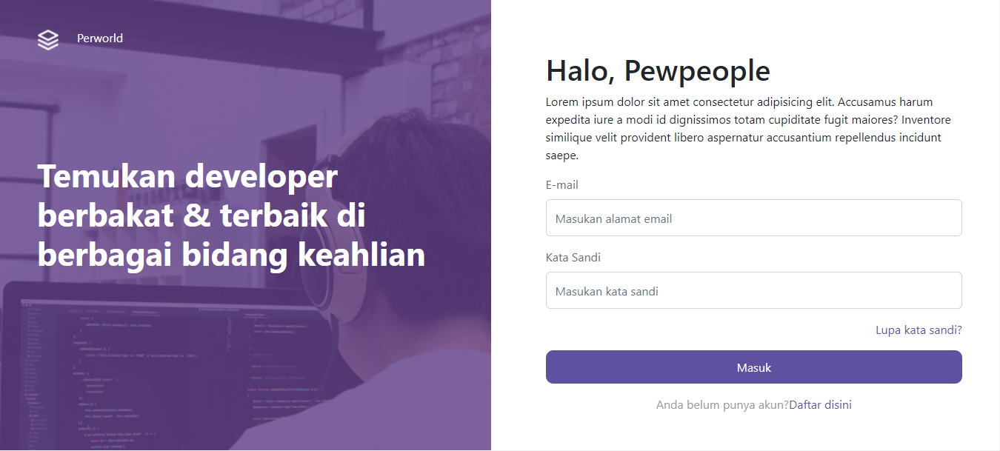
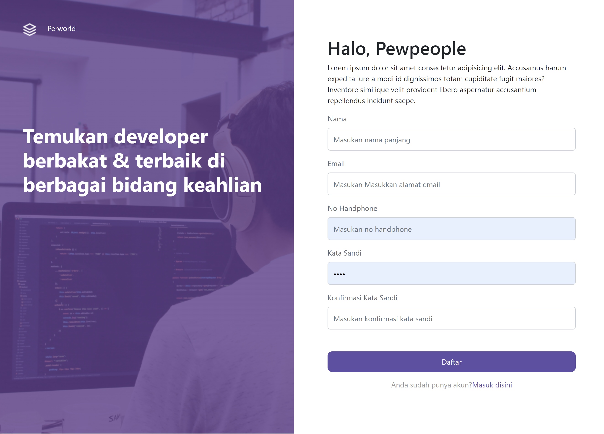

<h1>HireJobs (FE)</h1>

## Table of contents

- [Description](#Description)
- [Built With](#built-with)
- [Screenshoots](#screenshoots)
- [Related Project](#related-project)
- [Contributing](#contributing)
- [Run Project](#run-project)

## Description

HireJobs is a job search application, in this application users can log in as recruitment teams and job hunters. As a recruitment team, they will display a list of job hunters and CRUD on their profile page. As a job hunter, you will display your portfolio and work experience and CRUD on your profile. This application was created/developed using Postgresql and Next.js.

## Built With

This app was built with some technologies below:

- [Node.js](https://nodejs.org/en/)
- [React.js](https://reactjs.org/)
- [Bootstrap](https://getbootstrap.com/)
- [Axios](https://axios-http.com/)
- [Postgresql](https://www.postgresql.org/)

## Screenshoots

  

    Login & Register
  

  

    Landing Page
  

  

   Home Page
  

  

   Profile Pekerja Page
  

  

   Hiring Pekerja Page
  

  

    Profile Perekrut Page
  

  

    Hiring Perekrut Page
  

  

    Hire Page
  

## Related Project

RESTful API for this web application, clone this for development HireJobs.\

- [backend-HireJobs](https://github.com/rezafauzanakbar/backend-peworld)
- [deploy-vercel](https://frontend-peworld.vercel.app/)

## Contributing

Contributions are what make the open source community such an amazing place to be learn, inspire, and create. Any contributions you make are **greatly appreciated**.

1. Fork the Project
2. Create your Feature Branch (`git checkout -b your/branch`)
3. Commit your Changes (`git commit -m 'Add some AmazingFeature'`)
4. Push to the Branch (`git push origin feature/yourbranch`)
5. Open a Pull Request

## Run Project

Install package : npm i

Run Project : npm start
